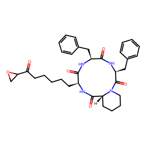
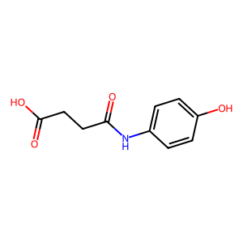

# Potensi Senyawa Herbal sebagai Inhibitor HDAC untuk Terapi Kanker Payudara: Pendekatan In Silico dan Pemodelan pIC50

## **Deskripsi Proyek**
Proyek ini bertujuan untuk memprediksi aktivitas biologis (*pIC50*) molekul terhadap target *Histone Deacetylase* (HDAC) menggunakan metode *Machine Learning*. Molekul yang diuji berasal dari [tanaman-tanaman herbal](Data/tanaman_herbal_indonesia_updated.csv) yang ada di Indonesia, Dilakukan analisis prediksi pICL50 untuk mengetahui inhibitor terbaik terhadap HDAC1, HDAC2 dan, HDAC6 juga dengan analisis kesamaan struktural menggunakan *Tanimoto Similarity* terhadap senyawa referensi *Vorinostat*.

---

## **Struktur Folder**
- **Data**: Berisi data mentah dan hasil preprocessing.
- **Model**: Berisi model yang telah dilatih.
- **Notebook**: Berisi notebook Jupyter untuk analisis dan eksplorasi data.
- **Result**: Berisi hasil akhir berupa prediksi pIC50 dan analisis Tanimoto Similarity.

---

## **Hasil Analisis**

### **Prediksi pIC50**
Hasil prediksi *pIC50* untuk molekul-molekul terbaik disimpan dalam format CSV dan HTML interaktif.

#### **Top 5 Molekul Berdasarkan pIC50**
1. [pIC50 Top 1 - Temu Kunci (3D)](Result/pIC50_top_1_TEMU_KUNCI_3D.html)
2. [pIC50 Top 2 - Temu Kunci (3D)](Result/pIC50_top_2_TEMU_KUNCI_3D.html)
3. [pIC50 Top 3 - Temu Kunci (3D)](Result/pIC50_top_3_TEMU_KUNCI_3D.html)
4. [pIC50 Top 4 - Temu Kunci (3D)](Result/pIC50_top_4_TEMU_KUNCI_3D.html)
5. [pIC50 Top 5 - Daun Ketapang (3D)](Result/pIC50_top_5_DAUN_KETAPANG_3D.html)

Prediksi lengkap tersedia di file:  
- [predicted_pIC50_results.csv](Result/predicted_pIC50_results.csv)

---

### **Tanimoto Similarity**
Hasil analisis kesamaan molekul terhadap *Vorinostat* menggunakan *Tanimoto Similarity* disimpan dalam format CSV dan HTML.
Penelitian ini mengkonfirmasi potensi Temu Kunci (Boesenbergia pandurata) sebagai agen anti kanker. Pada analisis komputasi in silico, senyawa aktif dari Temu Kunci, seperti CHEMBL274445, terbukti memiliki potensi sebagai inhibitor HDAC dengan nilai pIC50 tertinggi sebesar 8.83.

#### **Top 5 Molekul Berdasarkan Tanimoto Similarity**
1. [Tanimoto Top 1 (3D)](Result/Tanimoto_top_491_3D.html)
2. [Tanimoto Top 2 (3D)](Result/Tanimoto_top_2123_3D.html)
3. [Tanimoto Top 3 (3D)](Result/Tanimoto_top_2189_3D.html)
4. [Tanimoto Top 4 (3D)](Result/Tanimoto_top_2193_3D.html)
5. [Tanimoto Top 5 (3D)](Result/Tanimoto_top_2204_3D.html)

Hasil lengkap tersedia di file:  
- [tanimoto_similarity_results.csv](Result/tanimoto_similarity_results.csv)

---
